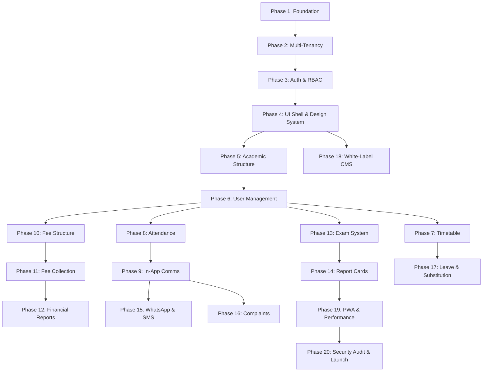

# PROJECT MILESTONES: Phased Delivery Roadmap

> **Document Type:** Engineering Milestone Plan
> **Version:** 1.0
> **Last Updated:** 2026-09-15
> **Total Phases:** 20
> **Total Milestones:** 68
> **Principle:** Each milestone is a small, testable, deployable unit. Ship quality, not quantity.

---

## Dependency Graph (Phase Ordering)



---

## Phase Overview Table

| Phase | Name | Milestones | Depends On | Core Deliverable |
|-------|------|-----------|------------|------------------|
| 1 | Foundation & Infrastructure | 4 | — | Working Next.js project with DB, Redis, env config |
| 2 | Multi-Tenancy Core | 3 | Phase 1 | Tenant resolution middleware, row-level isolation |
| 3 | Authentication & RBAC | 4 | Phase 2 | Login, password flows, role-based access guards |
| 4 | UI Shell & Design System | 4 | Phase 3 | Layout, navbar, sidebar, theme tokens, responsive shell |
| 5 | Academic Structure | 3 | Phase 4 | Sessions, classes, sections, subjects CRUD |
| 6 | User Management | 5 | Phase 5 | Student, parent, teacher, staff records + bulk import |
| 7 | Timetable & Scheduling | 3 | Phase 6 | Master timetable builder, daily view, substitution |
| 8 | Attendance System | 4 | Phase 6 | Mark, view, reports, admin dashboard |
| 9 | In-App Communications | 4 | Phase 8 | Messages, notifications, events, holidays, emergency contacts |
| 10 | Fee Structure & Invoicing | 3 | Phase 6 | Fee heads, structures, invoice generation |
| 11 | Fee Collection & Payments | 4 | Phase 10 | Counter collection, online payments, receipts |
| 12 | Financial Reports | 3 | Phase 11 | Defaulter reports, ledger, gateway reconciliation |
| 13 | Examination System | 3 | Phase 6 | Exam scheduler, marks entry, verification & lock |
| 14 | Report Cards | 3 | Phase 13 | Template designer, PDF generation, distribution |
| 15 | WhatsApp & SMS Integration | 3 | Phase 9 | WhatsApp Cloud API, SMS fallback, broadcast |
| 16 | Complaint & Feedback | 2 | Phase 9 | Submit, track, resolve grievances |
| 17 | Leave & Substitution | 3 | Phase 7 | Apply, approve, auto-substitution |
| 18 | White-Label CMS & Public Portal | 4 | Phase 4 | Public website, CMS pages, inquiry forms |
| 19 | PWA & Performance | 3 | Phase 14 | Service worker, offline, caching, performance tuning |
| 20 | Security Audit & Launch Prep | 3 | Phase 19 | Penetration testing, load testing, deployment |

---

---

# PHASE 1: Foundation & Infrastructure

> **Goal:** A fully configured, running Next.js project with database connectivity, Redis, environment validation, and development tooling — ready for feature development.

---

### Milestone 1.1 — Project Scaffolding & Tooling

**Deliverables:**
- [ ] Initialize Next.js project with TypeScript (`strict: true`)
- [ ] Configure `tsconfig.json` with strict settings (no implicit `any`, strict null checks)
- [ ] Install and configure Tailwind CSS with the project's custom design tokens
- [ ] Install shadcn/ui and initialize with the project's color palette
- [ ] Configure ESLint + Prettier with consistent rules
- [ ] Create the folder structure:
  ```
  src/
    app/           # Next.js App Router pages
    components/    # Shared UI components
    modules/       # Feature-specific vertical slices
    lib/           # Shared utilities, DB client, validators
    services/      # Business logic layer
    actions/       # Server actions
    types/         # Shared TypeScript types
    hooks/         # Custom React hooks
  docs/            # Project documentation (already exists)
  prisma/          # Prisma schema and migrations
  ```
- [ ] Create `.env.example` with all required env variable placeholders
- [ ] Create `README.md` with setup instructions

**Quality Gate:**
| Check | Command / Verification |
|-------|----------------------|
| TypeScript compiles | `npx tsc --noEmit` — zero errors |
| Dev server starts | `npm run dev` — loads on `localhost:3000` |
| Tailwind renders | Create a test page with brand colors — verify visually |
| Linting passes | `npm run lint` — zero warnings |

---

### Milestone 1.2 — Database Setup (PostgreSQL + Prisma)

**Deliverables:**
- [ ] Install Prisma and initialize with PostgreSQL provider
- [ ] Create the Prisma client singleton with connection pooling
- [ ] Define the base `Tenant` model in `schema.prisma`
- [ ] Run first migration: `npx prisma migrate dev --name init`
- [ ] Seed script for a test tenant
- [ ] Add `prisma generate` to the build pipeline

**Quality Gate:**
| Check | Command / Verification |
|-------|----------------------|
| Migration runs cleanly | `npx prisma migrate dev` — no errors |
| Prisma Client generates | `npx prisma generate` — types available |
| DB connection works | Seed script inserts and reads a test tenant |
| Schema matches design | Inspect DB tables in Prisma Studio: `npx prisma studio` |

---

### Milestone 1.3 — Environment Variable Validation

**Deliverables:**
- [ ] Install `@t3-oss/env-nextjs` and `zod`
- [ ] Create `src/env.ts` with typed, validated environment variables
- [ ] Group env vars: Database, Redis, Auth, External Services
- [ ] App fails fast on startup if any required env var is missing

**Quality Gate:**
| Check | Command / Verification |
|-------|----------------------|
| Missing env crashes app | Remove `DATABASE_URL` → app throws on startup |
| All env vars typed | Import `env` in a test file → full autocomplete, no `string \| undefined` |
| No `process.env` usage | `grep -r "process.env" src/` — returns zero results (all through `env.ts`) |

---

### Milestone 1.4 — Redis & BullMQ Setup

**Deliverables:**
- [ ] Install `ioredis` and `bullmq`
- [ ] Create Redis client singleton (`src/lib/redis.ts`)
- [ ] Create BullMQ queue factory (`src/lib/queue.ts`)
- [ ] Create a test queue + worker that processes a dummy job
- [ ] Verify connection with health check endpoint

**Quality Gate:**
| Check | Command / Verification |
|-------|----------------------|
| Redis connects | Health check endpoint returns `{ redis: "ok" }` |
| Queue processes jobs | Enqueue a test job → worker logs completion |
| Connection handles failure | Stop Redis → app logs error gracefully, no crash |
| No hardcoded URLs | Redis URL comes from `env.ts` |

---

---

# PHASE 2: Multi-Tenancy Core

> **Goal:** Every request is resolved to a verified `tenant_id` before any business logic executes. Row-level isolation is enforced at the data layer.

---

### Milestone 2.1 — Tenant Model & Domain Mapping Schema

**Deliverables:**
- [ ] Extend Prisma schema with full `Tenant` model:
  - `id`, `name`, `slug`, `customDomain`, `subdomain`, `logoUrl`, `primaryColor`, `status` (ACTIVE, SUSPENDED, TRIAL), `subscriptionPlan`, `createdAt`, `updatedAt`
- [ ] Create `TenantDomain` mapping table: `domain → tenantId` (for custom domains)
- [ ] Add unique constraints on `slug`, `customDomain`
- [ ] Seed multiple test tenants with different domains
- [ ] Run migration

**Quality Gate:**
| Check | Command / Verification |
|-------|----------------------|
| Migration clean | `npx prisma migrate dev` — no errors |
| Unique constraints work | Try inserting duplicate slug → Prisma throws unique violation |
| Seed works | `npx prisma db seed` → 3 test tenants exist |
| Schema reviewed | Every field has explicit type, no optional fields without default |

---

### Milestone 2.2 — Tenant Resolution Middleware

**Deliverables:**
- [ ] Create Next.js middleware (`src/middleware.ts`) that:
  1. Reads `Host` header from every incoming request
  2. Extracts subdomain OR looks up custom domain in cache/DB
  3. Resolves to a `tenant_id`
  4. Injects `tenant_id` into request headers (`x-tenant-id`)
  5. Returns 404 for unresolvable domains
- [ ] Add Redis caching for domain → tenant lookups (TTL: 5 minutes)
- [ ] Create `getTenantContext()` server utility that reads the resolved tenant from headers
- [ ] Handle edge cases: `www.` prefix, trailing dots, case insensitivity

**Quality Gate:**
| Check | Command / Verification |
|-------|----------------------|
| Subdomain resolves | Request to `school1.localhost:3000` → resolves correct `tenant_id` |
| Custom domain resolves | Simulated custom domain header → resolves correct `tenant_id` |
| Unknown domain → 404 | Request with unknown host → returns 404 page |
| Cache works | Second request hits Redis cache (no DB query) — verify via logs |
| No client-side tenant trust | `getTenantContext()` reads from server headers only |

---

### Milestone 2.3 — Tenant-Scoped Database Helpers

**Deliverables:**
- [ ] Create `withTenantScope(tenantId)` wrapper/utility that:
  - Automatically includes `tenantId` in all Prisma where clauses
  - Prevents accidental cross-tenant queries
- [ ] Create Prisma middleware or extension that:
  - Validates `tenantId` is present on every `create`, `update`, `delete`, `findMany`
  - Throws error if `tenantId` is missing on tenant-scoped models
- [ ] Define a `TENANT_SCOPED_MODELS` list — models that MUST have tenant isolation
- [ ] Write unit tests for cross-tenant leakage prevention

**Quality Gate:**
| Check | Command / Verification |
|-------|----------------------|
| Query without tenant fails | Call `findMany` without `tenantId` on scoped model → throws error |
| Cross-tenant read blocked | Tenant A's context cannot read Tenant B's records |
| Insert without tenant fails | `create` without `tenantId` → throws validation error |
| All scoped models listed | Review `TENANT_SCOPED_MODELS` against schema — none missing |

---

---

# PHASE 3: Authentication & RBAC

> **Goal:** Admin-provisioned login system with role-based access control. No signup. Password management flows only.

---

### Milestone 3.1 — User Model & Role System

**Deliverables:**
- [ ] Add `User` model to Prisma schema:
  - `id`, `tenantId`, `email`, `phone`, `passwordHash`, `firstName`, `lastName`, `role` (enum: `SUPER_ADMIN`, `ADMIN`, `ACCOUNTANT`, `TEACHER`, `STUDENT`, `PARENT`), `isActive`, `mustChangePassword`, `lastLoginAt`, `createdAt`, `updatedAt`
- [ ] Create `Role` enum with permissions mapping
- [ ] Add compound unique constraint: `(tenantId, email)`
- [ ] Run migration
- [ ] Seed admin users for test tenants

**Quality Gate:**
| Check | Command / Verification |
|-------|----------------------|
| Migration clean | `npx prisma migrate dev` — no errors |
| `tenantId` indexed | Verify `tenant_id` has an index on `User` table |
| Unique constraint works | Duplicate email within same tenant → error; same email in different tenant → allowed |
| Role enum defined | All 6 roles exist in schema |

---

### Milestone 3.2 — Login Flow (Server Action)

**Deliverables:**
- [ ] Install `bcryptjs` for password hashing
- [ ] Install `jose` (or NextAuth) for JWT/session management
- [ ] Create Zod schema: `LoginSchema = { email, password }`
- [ ] Create server action `loginAction(formData)`:
  1. Validate input with Zod
  2. Look up user by email + `tenantId` (from middleware context)
  3. Verify password hash
  4. Check `isActive` status
  5. Create session/JWT with `{ userId, tenantId, role }`
  6. Set HTTP-only secure cookie
  7. Return success or structured error
- [ ] Create login page UI with email + password form
- [ ] Handle error states: invalid credentials, account disabled, tenant suspended

**Quality Gate:**
| Check | Command / Verification |
|-------|----------------------|
| Valid login works | Correct credentials → redirects to dashboard |
| Invalid password rejected | Wrong password → shows "Invalid credentials" |
| Inactive user blocked | `isActive: false` user → shows "Account disabled" |
| Zod validates | Empty email → shows validation error before hitting DB |
| Session is tenant-scoped | JWT payload contains correct `tenantId` |
| Cookie is HTTP-only | Inspect cookie in browser DevTools → `httpOnly: true`, `secure: true` |
| No signup route exists | Navigate to `/signup` → 404 |

---

### Milestone 3.3 — Forgot Password & Change Password

**Deliverables:**
- [ ] Create Zod schemas: `ForgotPasswordSchema`, `ResetPasswordSchema`, `ChangePasswordSchema`
- [ ] Forgot Password flow:
  1. User submits email → server generates OTP (6-digit, 10-min expiry)
  2. OTP stored in Redis with key `otp:{tenantId}:{email}`
  3. OTP sent via SMS/WhatsApp (stub the delivery for now, log to console)
  4. User submits OTP + new password → server verifies and updates hash
- [ ] Change Password flow (from profile settings):
  1. User submits current password + new password
  2. Verify current password → update hash
- [ ] Force password change on first login if `mustChangePassword: true`

**Quality Gate:**
| Check | Command / Verification |
|-------|----------------------|
| OTP generated | Submit forgot password → OTP logged to console |
| OTP expires | Wait 10+ minutes → OTP submission rejected |
| OTP single-use | Use OTP once → second use rejected |
| Password actually changes | Reset password → login with new password works |
| Old password rejected | After change, old password fails login |
| First-login force change | User with `mustChangePassword` → redirected to change password page |
| Zod validates | Password < 8 chars → validation error |

---

### Milestone 3.4 — Role-Based Route Guards

**Deliverables:**
- [ ] Create `withAuth(roles[])` higher-order function for server actions/route handlers:
  1. Verify session/JWT exists and is valid
  2. Verify `tenantId` from session matches request context
  3. Verify user's role is in the allowed `roles[]` array
  4. Returns `{ userId, tenantId, role }` context or throws 401/403
- [ ] Create `<AuthGuard role={[...]} />` client component for conditional UI rendering
- [ ] Create middleware route matcher to protect `/dashboard/*` routes
- [ ] Redirect unauthenticated users to `/login`
- [ ] Redirect unauthorized users to `/unauthorized` page

**Quality Gate:**
| Check | Command / Verification |
|-------|----------------------|
| Unauthenticated → login | Visit `/dashboard` without session → redirected to `/login` |
| Wrong role → 403 | Teacher accessing admin-only route → 403/unauthorized page |
| Correct role → allowed | Admin accessing admin route → page loads |
| Expired session → login | Tamper with JWT expiry → redirected to `/login` |
| Tenant mismatch blocked | JWT with Tenant A + request for Tenant B → rejected |

---

---

# PHASE 4: UI Shell & Design System

> **Goal:** The application shell (navbar, sidebar, layout) is built with the design system tokens. Every subsequent feature plugs into this shell.

---

### Milestone 4.1 — Tailwind Config & Design Tokens

**Deliverables:**
- [ ] Configure `tailwind.config.ts` with all brand tokens (colors, fonts, radii, shadows, fontSize)
- [ ] Install Plus Jakarta Sans font (via `next/font/google`)
- [ ] Create CSS custom properties for the semantic colors
- [ ] Configure shadcn/ui theme to use brand colors
- [ ] Create a design system preview page (`/dev/design-system`) showing all tokens

**Quality Gate:**
| Check | Command / Verification |
|-------|----------------------|
| Font loads | Text renders in Plus Jakarta Sans — verify in DevTools |
| Colors match spec | Compare `brand-accent` (`#FA896B`), `brand-dark` (`#111C2D`) with design doc |
| shadcn components themed | Button renders with coral accent, not default blue |
| Preview page complete | All color swatches, typography scales, radius samples visible |

---

### Milestone 4.2 — Application Layout Shell

**Deliverables:**
- [ ] Create root layout with responsive sidebar + top navbar pattern
- [ ] Top Navbar:
  - School logo (dynamic per tenant) + platform title
  - Navigation dropdowns (Academics, Admin, Links)
  - Search bar (pill-shaped, `rounded-full`)
  - Notification bell with coral badge counter
  - Profile avatar with dropdown
- [ ] Sidebar:
  - Collapsible on desktop, drawer on mobile
  - Role-based menu items (different items for Admin vs Teacher vs Student)
  - Active state indicator
- [ ] Main content area with `max-w-[1440px]` centered, proper padding
- [ ] Mobile responsive: hamburger menu, no horizontal overflow

**Quality Gate:**
| Check | Command / Verification |
|-------|----------------------|
| Desktop layout | 1440px+ screens → sidebar visible, content centered |
| Tablet layout | 768px–1024px → sidebar collapsed, toggle button visible |
| Mobile layout | < 768px → sidebar hidden, hamburger menu, no horizontal scroll |
| Tenant branding | Different tenant → different logo and school name in navbar |
| Role-based menu | Login as Teacher → only teacher menu items visible |
| No overflow | Resize to 320px width → no horizontal scrollbar |

---

### Milestone 4.3 — Reusable Component Library

**Deliverables:**
- [ ] Build these reusable components following the design system:
  - `<MetricTile />` — Hero metric tiles (coral background, icon, counter, label)
  - `<StudentIdentityCard />` — Avatar, name, section, program, action button
  - `<DonutRing />` — SVG circular progress with animated `stroke-dashoffset`
  - `<ProgressPill />` — Linear progress bar with label and percentage
  - `<DataCard />` — White card with `shadow-card`, hover elevation, `rounded-card`
  - `<PageHeader />` — Section title with optional breadcrumbs
  - `<EmptyState />` — Illustration + message for empty data states
  - `<ConfirmDialog />` — Destructive action confirmation modal
- [ ] Document each component's props with JSDoc
- [ ] All components use Server Components where possible

**Quality Gate:**
| Check | Command / Verification |
|-------|----------------------|
| All components render | Preview page shows each component — no console errors |
| Animations work | DonutRing animates on load (800ms ease-out) |
| Card hover works | DataCard lifts on hover (`translate-y-[-2px]`, `shadow-card-hover`) |
| Mobile responsive | All components render without overflow on 320px width |
| Props are typed | Each component has explicit TypeScript interface — no `any` |

---

### Milestone 4.4 — Data Table & Form Primitives

**Deliverables:**
- [ ] Build `<DataTable />` component:
  - Server-side pagination
  - Column sorting
  - Search/filter bar
  - Responsive: cards view on mobile, table on desktop
  - Loading skeleton state
  - Empty state
- [ ] Build form primitives:
  - `<FormField />` — Label + input + error message wrapper
  - `<SearchableSelect />` — Dropdown with search (for Class, Section, Subject pickers)
  - `<DatePicker />` — Calendar date picker
  - `<FileUpload />` — Drag-and-drop for Excel/CSV uploads
- [ ] All form fields integrate with `react-hook-form` + Zod resolver

**Quality Gate:**
| Check | Command / Verification |
|-------|----------------------|
| Table paginates | 100+ rows → shows page controls, loads page 2 correctly |
| Table sorts | Click column header → data re-sorts |
| Table mobile view | < 768px → switches to card layout, no horizontal scroll |
| Form validates | Submit empty form → Zod errors appear inline |
| File upload works | Drag Excel file → file name displayed, ready for processing |

---

---

# PHASE 5: Academic Structure

> **Goal:** Admin can configure academic sessions, classes, sections, and subjects — the foundational entities everything else depends on.

---

### Milestone 5.1 — Academic Session Management

**Deliverables:**
- [ ] Prisma models: `AcademicSession` (`id`, `tenantId`, `name`, `startDate`, `endDate`, `isCurrent`, `status`)
- [ ] Admin CRUD for academic sessions (create, list, set current, archive)
- [ ] Zod schemas for all inputs
- [ ] Service layer: `sessionService.create()`, `sessionService.getCurrent()`, `sessionService.list()`
- [ ] Business rule: Only ONE session can be `isCurrent: true` per tenant
- [ ] UI: Sessions settings page with list, create modal, activate button

**Quality Gate:**
| Check | Command / Verification |
|-------|----------------------|
| CRUD works | Create session → appears in list; edit name → updates; archive → status changes |
| Only one current | Activate Session B → Session A auto-deactivates |
| Tenant isolation | Tenant A's sessions invisible to Tenant B |
| Zod validates | Overlapping dates → validation error |
| `tenantId` on all queries | Review service layer — every DB call includes `tenantId` |

---

### Milestone 5.2 — Class & Section Management

**Deliverables:**
- [ ] Prisma models: `Class` (`id`, `tenantId`, `sessionId`, `name`, `sortOrder`), `Section` (`id`, `tenantId`, `classId`, `name`)
- [ ] Admin CRUD for classes and sections
- [ ] Seed common classes (Class 1–12) with default sections (A, B)
- [ ] UI: Classes page with nested section management (expandable rows)
- [ ] Drag-and-drop or manual sort order for classes

**Quality Gate:**
| Check | Command / Verification |
|-------|----------------------|
| Create class + sections | Create "Class 10" with sections A, B, C → all appear |
| Delete cascade | Delete a class → its sections are removed |
| Sort order works | Reorder classes → order persists on reload |
| Tenant isolation | Different tenant → different class lists |
| Session-scoped | Switch academic session → different class set |

---

### Milestone 5.3 — Subject Management & Mapping

**Deliverables:**
- [ ] Prisma models: `Subject` (`id`, `tenantId`, `name`, `code`, `type` [THEORY, PRACTICAL, LANGUAGE]), `ClassSubject` (`classId`, `subjectId`, `teacherId`)
- [ ] Admin CRUD for subjects
- [ ] Admin UI for mapping subjects to classes
- [ ] Admin UI for assigning teachers to class-subjects (after Phase 6, leave `teacherId` nullable for now)
- [ ] Prevent duplicate subject codes per tenant

**Quality Gate:**
| Check | Command / Verification |
|-------|----------------------|
| Subject CRUD works | Create "Mathematics" (MATH) → appears in list |
| Duplicate code blocked | Create another subject with code "MATH" → error |
| Map to class | Assign Mathematics to Class 10 → mapping visible |
| Tenant isolation | Different tenants have independent subject lists |
| Code is unique per tenant | Same code allowed across different tenants |

---

---

# PHASE 6: User Management (Students, Parents, Teachers, Staff)

> **Goal:** Admin can create, view, edit, and bulk-import all user types. This is the data backbone for every subsequent feature.

---

### Milestone 6.1 — Student Record Manager (Single Entry)

**Deliverables:**
- [ ] Prisma models: `Student` (`id`, `tenantId`, `userId`, `admissionNumber`, `rollNumber`, `classId`, `sectionId`, `sessionId`, `dateOfBirth`, `gender`, `address`, `bloodGroup`, `profileImageUrl`, `isActive`)
- [ ] Admin UI: Student list page with search, filters (class, section), pagination
- [ ] Admin UI: Add student form with all fields + Zod validation
- [ ] Admin UI: Edit student profile page
- [ ] Auto-create a `User` record (role: `STUDENT`) when student is added
- [ ] Generate temporary password and display it to admin (one-time view)

**Quality Gate:**
| Check | Command / Verification |
|-------|----------------------|
| Create student | Fill form → student appears in list with correct class/section |
| User auto-created | New student → corresponding User record exists with `role: STUDENT` |
| Temp password shown | After creation → modal shows temp password (not retrievable later) |
| Duplicate admission # blocked | Same admission number → validation error |
| Filter works | Filter by "Class 10, Section A" → only matching students shown |
| Tenant isolation | Tenant A's students not visible in Tenant B |

---

### Milestone 6.2 — Parent Linking & Records

**Deliverables:**
- [ ] Prisma models: `Parent` (`id`, `tenantId`, `userId`, `fatherName`, `motherName`, `guardianName`, `fatherPhone`, `motherPhone`, `guardianPhone`, `fatherEmail`, `motherEmail`, `occupation`, `address`)
- [ ] `StudentParent` relation: One parent can have multiple students (siblings)
- [ ] Admin UI: Link parent to student during student creation or separately
- [ ] Auto-create `User` record for parent (role: `PARENT`)
- [ ] Parent can view all their linked children's data

**Quality Gate:**
| Check | Command / Verification |
|-------|----------------------|
| Parent linked to student | Create student with parent info → parent record and user created |
| Sibling linking | Link second student to same parent → parent sees both children |
| Parent login works | Parent logs in → sees their children's dashboard |
| Phone uniqueness | Same parent phone within tenant → links to existing parent (not duplicate) |
| Tenant isolation | Parent in Tenant A cannot see Tenant B's data |

---

### Milestone 6.3 — Teacher & Staff Directory

**Deliverables:**
- [ ] Prisma models: `Teacher` (`id`, `tenantId`, `userId`, `employeeCode`, `department`, `designation`, `qualification`, `joiningDate`, `phone`, `email`, `profileImageUrl`, `isActive`)
- [ ] Extend for non-teaching staff: `Staff` model or `staffType` field
- [ ] Admin UI: Teacher list with search, filter by department
- [ ] Admin UI: Add/edit teacher form
- [ ] Auto-create `User` record (role: `TEACHER`)

**Quality Gate:**
| Check | Command / Verification |
|-------|----------------------|
| Teacher CRUD works | Create teacher → appears in directory with correct department |
| User auto-created | New teacher → User record with `role: TEACHER` exists |
| Employee code unique | Duplicate employee code within tenant → error |
| Search works | Search by name or department → correct results |
| Tenant isolation | Each tenant has independent teacher directory |

---

### Milestone 6.4 — Bulk Import (Excel/CSV Upload)

**Deliverables:**
- [ ] Create Excel template generator:
  - Download blank template with headers for student import
  - Download blank template for teacher import
- [ ] Create bulk import pipeline:
  1. Admin uploads filled Excel/CSV
  2. Server parses file (use `xlsx` or `papaparse`)
  3. Validate every row with Zod (collect all errors, don't stop at first)
  4. Show preview: valid rows (green), invalid rows (red) with error details
  5. Admin confirms → batch insert valid rows inside a transaction
  6. Return summary: X imported, Y skipped with reasons
- [ ] Handle duplicates gracefully (skip or update based on admission number)

**Quality Gate:**
| Check | Command / Verification |
|-------|----------------------|
| Template downloads | Click download → valid Excel file with correct headers |
| Valid file imports | Upload 50-row valid file → all 50 students created |
| Invalid rows flagged | Upload file with 3 bad rows → preview shows 3 errors with details |
| Partial import works | 47 valid + 3 invalid → 47 imported, 3 skipped |
| Duplicate handling | Re-upload same file → no duplicates created (skip or update) |
| Large file handled | Upload 500 rows → processes without timeout (background job if needed) |
| Transaction safety | Error at row 48 of 50 → entire batch rolls back (or only row 48 skips) |

---

### Milestone 6.5 — Credential Manager (Archive/Deactivate)

**Deliverables:**
- [ ] Admin UI: Archive passing-out students (batch by class/section at year-end)
- [ ] Admin UI: Deactivate resigned teachers
- [ ] Soft delete: Set `isActive: false` on User + Student/Teacher records
- [ ] Archived records viewable in a separate "Archived" tab (not mixed with active)
- [ ] Archived users cannot login
- [ ] Reactivation possible if admin needs to undo

**Quality Gate:**
| Check | Command / Verification |
|-------|----------------------|
| Archive student | Archive student → disappears from active list, appears in archived |
| Archived user blocked | Archived student tries login → "Account disabled" |
| Batch archive | Select "Class 10 Section A" → all students archived at once |
| Reactivation works | Reactivate archived student → back in active list, can login |
| Archived not in queries | Active student queries never return archived records |

---

---

# PHASE 7: Timetable & Scheduling

> **Goal:** Admin builds the master timetable. Teachers see today's classes. Students see their schedule.

---

### Milestone 7.1 — Master Timetable Builder

**Deliverables:**
- [ ] Prisma models: `TimetableSlot` (`id`, `tenantId`, `sessionId`, `classId`, `sectionId`, `subjectId`, `teacherId`, `dayOfWeek`, `startTime`, `endTime`, `roomNumber`, `slotType` [LECTURE, TUTORIAL, LAB, BREAK])
- [ ] Admin UI: Weekly grid builder (rows = time slots, columns = days)
- [ ] Conflict detection: Same teacher cannot be in two rooms at the same time
- [ ] Conflict detection: Same room cannot be double-booked
- [ ] Clone timetable from one section to another (with teacher reassignment)

**Quality Gate:**
| Check | Command / Verification |
|-------|----------------------|
| Create timetable | Build Monday schedule for Class 10-A → slots saved |
| Teacher conflict blocked | Assign same teacher to 2 classes at same time → error |
| Room conflict blocked | Assign 2 classes to same room at same time → error |
| Clone works | Clone Class 10-A to 10-B → slots copied with different teachers |
| Full week visible | Switch between days → complete weekly view |
| Tenant isolation | Each tenant has independent timetables |

---

### Milestone 7.2 — Student & Teacher Daily View

**Deliverables:**
- [ ] Student dashboard widget: "Upcoming Schedule" with time-slot tabs (8-12, 12-3, 3-6)
- [ ] Design matches spec: Active tab coral, white entry strips with left accent border
- [ ] Teacher dashboard widget: "Today's Classes" showing assigned periods
- [ ] Both views filter by current day of week
- [ ] Show room number, section, subject, and time for each slot

**Quality Gate:**
| Check | Command / Verification |
|-------|----------------------|
| Student sees own timetable | Login as student → sees Class 10-A schedule for today |
| Teacher sees assigned classes | Login as teacher → sees only their assigned periods |
| Time tabs work | Click "12 to 3" → shows afternoon slots only |
| Today filter | On Monday → shows Monday schedule; on Tuesday → shows Tuesday |
| Design matches | Visual comparison against design spec — coral accents, card styling |

---

### Milestone 7.3 — Substitution Manager

**Deliverables:**
- [ ] Admin UI: When a teacher is marked on leave, show their periods for that day
- [ ] Admin UI: For each period, show available teachers (no conflict at that time)
- [ ] Admin assigns substitute teacher to each period
- [ ] Prisma model: `Substitution` (`id`, `tenantId`, `originalSlotId`, `substituteTeacherId`, `date`, `reason`)
- [ ] Notification sent to substitute teacher (in-app — WhatsApp comes in Phase 15)
- [ ] Updated timetable reflects substitution for that day

**Quality Gate:**
| Check | Command / Verification |
|-------|----------------------|
| Leave triggers substitution UI | Teacher on leave → admin sees their periods to reassign |
| Available teachers shown | Only teachers free at that slot time are shown |
| Substitution saved | Assign substitute → saved in DB, visible in timetable |
| Teacher notified | Substitute teacher sees notification about new assignment |
| Original timetable unchanged | Next day → original teacher's slots restored (substitution is date-specific) |

---

---

# PHASE 8: Attendance System

> **Goal:** Teachers mark daily attendance in under 30 seconds. Students view their attendance. Admin sees school-wide analytics.

---

### Milestone 8.1 — Teacher Marks Class Attendance

**Deliverables:**
- [ ] Prisma models: `Attendance` (`id`, `tenantId`, `studentId`, `classId`, `sectionId`, `date`, `status` [PRESENT, ABSENT, LATE, HALF_DAY], `markedById`, `markedAt`)
- [ ] Teacher UI: Select class/section → student list loads → one-tap toggle per student
- [ ] Default all students to `PRESENT` → teacher marks exceptions (ABSENT/LATE/HALF_DAY)
- [ ] "Mark All Present" button for fast days
- [ ] Submit button → saves all records atomically
- [ ] Prevent duplicate submissions for same class/date (edit mode for corrections)
- [ ] **Performance target: 45 students marked in under 30 seconds on mobile**

**Quality Gate:**
| Check | Command / Verification |
|-------|----------------------|
| Mark attendance | Select Class 10-A → 45 students load → mark 3 absent → submit → saved |
| Under 30 seconds | Time the flow on mobile Chrome: load to submit < 30s |
| Duplicate blocked | Try submitting again for same class/date → shows "Already submitted" with edit option |
| Edit mode works | Edit previous attendance → changes saved correctly |
| Atomic save | Network error mid-save → no partial records saved |
| Tenant isolation | Teacher in Tenant A cannot mark attendance for Tenant B |
| Mobile optimized | Full flow works on 360px wide screen with no horizontal scroll |

---

### Milestone 8.2 — Student Attendance View

**Deliverables:**
- [ ] Student dashboard: Attendance donut ring (overall % with SVG animation)
- [ ] Subject-wise attendance pills (horizontal carousel with linear progress bars)
- [ ] Monthly calendar view: Color-coded days (green = present, red = absent, yellow = late)
- [ ] Color thresholds: ≥ 75% → Emerald Green, < 75% → Amber warning

**Quality Gate:**
| Check | Command / Verification |
|-------|----------------------|
| Donut shows correct % | 82 present out of 100 → donut shows 82% |
| Animation plays | Ring animates from 0 to actual value on page load (800ms) |
| Subject pills accurate | Each subject shows correct attendance percentage |
| Calendar view works | Click month → colored dots on each day show attendance status |
| Warning threshold | Attendance < 75% → amber color applied to ring |

---

### Milestone 8.3 — Teacher Self-Attendance

**Deliverables:**
- [ ] Prisma model: `TeacherAttendance` (`id`, `tenantId`, `teacherId`, `date`, `status`, `checkInTime`, `checkOutTime`)
- [ ] Teacher UI: "Mark Attendance" button on dashboard (one-tap check-in)
- [ ] Admin UI: View teacher attendance records with filters
- [ ] Monthly summary view for teachers

**Quality Gate:**
| Check | Command / Verification |
|-------|----------------------|
| Teacher checks in | Click "Mark Attendance" → record created with timestamp |
| Duplicate blocked | Already marked today → button shows "Checked In ✓" |
| Admin sees records | Admin views teacher attendance → correct records with dates |
| Monthly summary | Teacher sees X present, Y absent for the month |

---

### Milestone 8.4 — Admin Attendance Oversight Dashboard

**Deliverables:**
- [ ] Admin dashboard: School-wide attendance summary (today's stats)
  - Total present / absent / late across all classes
  - Class-wise breakdown bar chart
  - Section-wise drilldown
- [ ] Absent rate trends (7-day and 30-day line charts)
- [ ] "Classes Not Yet Marked" alert widget (which classes haven't submitted today)
- [ ] Export attendance report to Excel

**Quality Gate:**
| Check | Command / Verification |
|-------|----------------------|
| Today's stats accurate | Match dashboard numbers against raw DB records |
| Class-wise breakdown | Each class shows correct present/absent count |
| Unmarked classes alert | Class 10-B not marked → appears in "Not Yet Marked" list |
| Trend chart renders | 7-day line chart shows correct data points |
| Excel export works | Click export → downloads valid Excel with correct data |
| Tenant isolation | Admin sees only their school's data |

---

---

# PHASE 9: In-App Communications, Events & Directory

> **Goal:** Internal messaging, school event notifications, holidays calendar, and emergency contacts — all within the app.

---

### Milestone 9.1 — In-App Message / Notification Center

**Deliverables:**
- [ ] Prisma models: `Notification` (`id`, `tenantId`, `recipientId`, `title`, `body`, `type` [GENERAL, ATTENDANCE, FEE, EVENT, SYSTEM], `isRead`, `actionUrl`, `createdAt`)
- [ ] Notification bell icon with unread count badge (coral)
- [ ] Notification dropdown/page: List of notifications, mark as read, mark all read
- [ ] Server utility: `notificationService.send({ tenantId, recipientId, title, body, type })`
- [ ] Bulk send: Send to all students in a class, all teachers, or entire school

**Quality Gate:**
| Check | Command / Verification |
|-------|----------------------|
| Notification created | Send notification → appears in recipient's bell dropdown |
| Unread count correct | 5 unread → badge shows "5"; read one → shows "4" |
| Mark all read | Click "Mark all read" → count drops to 0, all items greyed |
| Bulk send works | Send to Class 10-A → all students in that class receive it |
| Tenant isolation | Notifications scoped to tenant — no cross-tenant leakage |

---

### Milestone 9.2 — School Event & News Manager

**Deliverables:**
- [ ] Prisma models: `Event` (`id`, `tenantId`, `title`, `description`, `eventDate`, `eventTime`, `location`, `category` [ACADEMIC, CULTURAL, SPORTS, ANNOUNCEMENT], `imageUrl`, `isPublished`, `createdById`, `createdAt`)
- [ ] Admin UI: Create/edit/publish events with rich text description and image upload
- [ ] Student/Teacher UI: Event feed on dashboard ("What's Happening" section)
- [ ] Event detail page with full description and image
- [ ] Auto-generate notification to all users when event is published

**Quality Gate:**
| Check | Command / Verification |
|-------|----------------------|
| Create event | Admin creates event → saved, visible in admin list |
| Publish event | Publish → appears in student/teacher dashboard feed |
| Image upload | Upload event image → renders correctly in feed and detail page |
| Notification sent | Publishing triggers notification to all active users |
| Draft not visible | Unpublished event → admin sees it, students do not |

---

### Milestone 9.3 — Academic Calendar & Holiday List

**Deliverables:**
- [ ] Prisma models: `Holiday` (`id`, `tenantId`, `sessionId`, `name`, `date`, `type` [NATIONAL, STATE, SCHOOL, EXAM_BREAK], `isRecurring`)
- [ ] Admin UI: Create and manage holidays for the academic session
- [ ] Student/Teacher UI: Holiday list page with upcoming holidays highlighted
- [ ] Calendar widget on dashboard showing holidays and events color-coded
- [ ] Prevent attendance marking on holidays (soft block with override option)

**Quality Gate:**
| Check | Command / Verification |
|-------|----------------------|
| Create holiday | Add "Diwali — Oct 20" → appears in holiday list |
| Calendar shows holidays | Holiday dates highlighted in calendar widget |
| Attendance blocked on holiday | Try marking attendance on holiday → warning "Today is a holiday" |
| Student view | Students see upcoming holidays with dates and names |
| Session-scoped | Holidays belong to specific academic session |

---

### Milestone 9.4 — Emergency Contacts & Authority Directory

**Deliverables:**
- [ ] Prisma models: `EmergencyContact` (`id`, `tenantId`, `name`, `designation`, `phone`, `email`, `category` [MEDICAL, ADMINISTRATION, SECURITY, FIRE, POLICE])
- [ ] Prisma models: `Authority` (`id`, `tenantId`, `userId`, `title`, `department`, `displayOrder`, `isBookable`)
- [ ] Admin UI: Manage emergency contacts and authority profiles
- [ ] Student/Teacher UI: Emergency contacts quick-access page
- [ ] Student UI: "Know Your Authorities" carousel (as per design spec)
  - Circular avatar, role pill tag, name, email, phone, "Book Appointment" button
- [ ] Appointment booking: Creates a notification to the authority (simple for now)

**Quality Gate:**
| Check | Command / Verification |
|-------|----------------------|
| Emergency contacts visible | Students and teachers see the emergency contact list |
| Authority carousel renders | Circular avatars, role tags, coral accent — matches design spec |
| Book appointment | Click "Book Appointment" → notification sent to authority |
| Admin manages | Admin can add/edit/remove emergency contacts and authorities |
| Tenant isolation | Each school has its own emergency contacts |

---

---

# PHASE 10: Fee Structure & Invoicing

> **Goal:** Admin defines fee structures by class. System auto-generates invoices for students. Zero margin for error.

---

### Milestone 10.1 — Fee Head & Structure Builder

**Deliverables:**
- [ ] Prisma models: `FeeHead` (`id`, `tenantId`, `name`, `type` [TUITION, TRANSPORT, ADMISSION, ANNUAL, EXAM, LATE_FEE, OTHER], `isRecurring`, `frequency` [MONTHLY, QUARTERLY, ANNUALLY, ONE_TIME])
- [ ] Prisma models: `FeeStructure` (`id`, `tenantId`, `sessionId`, `classId`, `feeHeadId`, `amount`, `dueDay`)
- [ ] Admin UI: Define fee heads (Tuition, Transport, etc.)
- [ ] Admin UI: Build fee structures per class → assign amounts to each fee head
- [ ] Clone fee structure from previous session
- [ ] Late fine configuration: Amount/day or percentage after due date

**Quality Gate:**
| Check | Command / Verification |
|-------|----------------------|
| Create fee head | Create "Tuition Fee (Monthly)" → appears in list |
| Build structure | Assign ₹5,000/month tuition to Class 10 → saved |
| Clone from last session | Clone → amounts copied, editable for new session |
| Late fine configured | Set ₹50/day after due date → configuration saved |
| Tenant isolation | Each school has independent fee structures |
| Amount precision | Amounts stored as integers (paise) — no floating point |

---

### Milestone 10.2 — Invoice Generation Engine

**Deliverables:**
- [ ] Prisma models: `Invoice` (`id`, `tenantId`, `studentId`, `sessionId`, `feeHeadId`, `invoiceNumber`, `amount`, `dueDate`, `lateFine`, `totalDue`, `paidAmount`, `status` [PENDING, PARTIAL, PAID, OVERDUE, WAIVED], `createdAt`)
- [ ] Batch invoice generation: Admin selects class + month → system generates invoices for all students
- [ ] Auto-calculate late fines on overdue invoices (scheduled job or on-access)
- [ ] Invoice number auto-increment per tenant (e.g., `INV-2026-0001`)
- [ ] Service: `invoiceService.generateForClass(tenantId, classId, feeHeadId, month)`

> [!CAUTION]
> All invoice operations must be inside `db.$transaction()`.

**Quality Gate:**
| Check | Command / Verification |
|-------|----------------------|
| Batch generation | Generate for Class 10 (60 students) → 60 invoices created |
| Invoice numbers sequential | INV-2026-0001 through INV-2026-0060 — no gaps |
| Late fine calculates | Invoice overdue by 5 days at ₹50/day → ₹250 late fine added |
| Status correct | New → PENDING; paid partial → PARTIAL; paid full → PAID |
| No duplicates | Generate same month twice → error or skip existing |
| Transaction safety | Failure mid-batch → entire batch rolled back |

---

### Milestone 10.3 — Student Fee Dashboard

**Deliverables:**
- [ ] Student dashboard: Fee summary card showing total due / paid / outstanding
- [ ] Student UI: Fee history page with all invoices (filterable by status, month)
- [ ] Invoice detail: Breakdown of fee heads, amounts, late fines, payments
- [ ] "Nil Due" badge (green) when everything is paid
- [ ] "Pay Fee" button (coral accent — online payment comes in Phase 11)

**Quality Gate:**
| Check | Command / Verification |
|-------|----------------------|
| Summary correct | Dashboard shows correct total due and paid amounts |
| Invoice list works | All invoices visible with correct statuses |
| Filter works | Filter by "OVERDUE" → only overdue invoices shown |
| Nil due badge | All paid → green "Nil Due" badge displayed |
| Design matches | Coral "Pay Fee" button, card styling matches design spec |

---

---

# PHASE 11: Fee Collection & Payments

> **Goal:** Accept payments both at the counter (cash/UPI/POS) and online (payment gateway). Print receipts. Zero ledger discrepancy.

---

### Milestone 11.1 — Counter Fee Collection (Offline)

**Deliverables:**
- [ ] Prisma models: `Payment` (`id`, `tenantId`, `invoiceId`, `amount`, `method` [CASH, UPI, CHEQUE, POS, ONLINE], `receiptNumber`, `collectedById`, `referenceNumber`, `remarks`, `createdAt`)
- [ ] Accountant UI: Search student → view outstanding invoices → select invoices to pay
- [ ] Accept partial or full payment
- [ ] Payment method selection: Cash / UPI / Cheque / POS
- [ ] Auto-generate receipt number per tenant (e.g., `RCP-2026-0001`)
- [ ] Update invoice `paidAmount` and `status` atomically

> [!CAUTION]
> The entire operation (payment create + invoice update + receipt number increment) MUST execute inside `db.$transaction()`.

- [ ] **Target: Complete the pay flow (search → collect → receipt) in under 15 seconds**

**Quality Gate:**
| Check | Command / Verification |
|-------|----------------------|
| Full payment | Pay ₹5,000 against ₹5,000 invoice → status changes to PAID |
| Partial payment | Pay ₹3,000 against ₹5,000 → status PARTIAL, balance ₹2,000 |
| Receipt generated | Payment creates receipt RCP-2026-0001, next is RCP-2026-0002 |
| Transaction atomic | Simulate failure after payment create → invoice NOT updated (rollback) |
| Under 15 seconds | Time the flow: search → select → pay → receipt < 15s |
| Method recorded | Cash payment → `method: CASH` saved correctly |
| Accountant only | Teacher cannot access fee collection page |

---

### Milestone 11.2 — Receipt Printing

**Deliverables:**
- [ ] Receipt template: School name, receipt number, student name, class/section, fee breakdown, amount paid, balance, payment method, date, collected by
- [ ] Print-optimized CSS (`@media print`) for dual-copy slip format
- [ ] "Print Receipt" button after successful payment
- [ ] Receipt preview in modal before printing
- [ ] Receipt history: Accountant can reprint any past receipt

**Quality Gate:**
| Check | Command / Verification |
|-------|----------------------|
| Print renders | Click "Print Receipt" → browser print dialog with clean receipt |
| Dual copy | Print output shows two copies (school copy + parent copy) on one page |
| All details correct | Receipt shows correct student name, amount, receipt #, date |
| Reprint works | Search old receipt by number → print again |
| No UI chrome | Print output has no navbar, sidebar, or browser UI elements |

---

### Milestone 11.3 — Online Payment (Razorpay Integration)

**Deliverables:**
- [ ] Integrate Razorpay (or Cashfree/Easebuzz) SDK
- [ ] Student/Parent UI: "Pay Online" button on outstanding invoices
- [ ] Create Razorpay order with correct amount and metadata
- [ ] Handle payment success callback → create Payment record inside transaction
- [ ] Webhook endpoint for payment confirmation (server-to-server)
- [ ] Webhook is **idempotent** — duplicate webhooks don't create duplicate payments

**Quality Gate:**
| Check | Command / Verification |
|-------|----------------------|
| Order creates | Click "Pay Online" → Razorpay checkout opens with correct amount |
| Payment records | Successful payment → Payment record created, invoice updated |
| Webhook idempotent | Send same webhook twice → only one Payment record exists |
| Failed payment handled | Payment fails → invoice status unchanged, error shown to user |
| Transaction safety | Order confirmed but DB write fails → retried via webhook |
| Secrets not exposed | Razorpay keys accessed via `env.ts` — not in client bundle |

---

### Milestone 11.4 — Payment Gateway Settlement Reconciliation

**Deliverables:**
- [ ] Admin UI: Settlement dashboard showing:
  - Total collections (online vs offline) for a date range
  - Gateway settlement vs internal records comparison
  - Unmatched/pending settlements flagged
- [ ] Export settlement report to Excel
- [ ] Daily automated reconciliation job (BullMQ) to flag mismatches

**Quality Gate:**
| Check | Command / Verification |
|-------|----------------------|
| Totals match | Sum of all payments matches dashboard total |
| Online vs offline split | Cash and online totals shown separately — both correct |
| Mismatch flagged | Simulated mismatch → appears in flagged list |
| Export works | Download Excel → data matches dashboard |

---

---

# PHASE 12: Financial Reports

> **Goal:** Admin and accountant can generate defaulter lists, fee ledgers, and collection summaries.

---

### Milestone 12.1 — Defaulter Report

**Deliverables:**
- [ ] Admin/Accountant UI: Defaulter list page
  - Filter by class, section, fee head, overdue duration
  - Show student name, class, total due, overdue amount, days overdue
  - Sort by highest outstanding first
- [ ] Summary stats: Total defaulters count, total overdue amount
- [ ] Export to Excel / PDF

**Quality Gate:**
| Check | Command / Verification |
|-------|----------------------|
| Defaulters listed | Students with overdue invoices appear in list |
| Filter works | Filter "Class 10, overdue > 30 days" → correct subset |
| Amounts accurate | Cross-verify outstanding amounts against invoice records |
| Export works | Download Excel → data matches on-screen report |

---

### Milestone 12.2 — Fee Ledger & Collection Reports

**Deliverables:**
- [ ] Student-level fee ledger: All invoices + payments in chronological order with running balance
- [ ] Class-level collection summary: Total collected vs total expected per class
- [ ] Monthly collection report: Day-by-day collection totals with method breakdown
- [ ] All reports exportable to Excel

**Quality Gate:**
| Check | Command / Verification |
|-------|----------------------|
| Ledger balanced | Running balance calculation matches: expected - paid = outstanding |
| Class summary accurate | Total collected for Class 10 matches sum of all payments |
| Monthly report | Each day's collection total matches sum of that day's payments |
| Export works | All three reports download as valid Excel files |

---

### Milestone 12.3 — Admin Finance Dashboard Widgets

**Deliverables:**
- [ ] Admin dashboard cards:
  - Total fee collected this month (with comparison to last month)
  - Total outstanding across school
  - Defaulter count
  - Today's counter collections
- [ ] Quick action buttons: "View Defaulters", "Daily Collection Report"
- [ ] Cash-counter reconciliation widget: Today's cash vs UPI vs cheque totals

**Quality Gate:**
| Check | Command / Verification |
|-------|----------------------|
| Dashboard loads fast | All widgets load within 2 seconds |
| Numbers accurate | Each widget's number verified against raw DB queries |
| Quick actions work | Click "View Defaulters" → navigates to defaulter report |
| Reconciliation correct | Cash + UPI + Cheque = Total counter collection |

---

---

# PHASE 13: Examination System

> **Goal:** Admin schedules exams. Teachers upload marks. Admin verifies and locks marks.

---

### Milestone 13.1 — Exam Scheduler & Date Sheet

**Deliverables:**
- [ ] Prisma models: `Exam` (`id`, `tenantId`, `sessionId`, `name`, `type` [UNIT_TEST, MID_TERM, FINAL], `startDate`, `endDate`, `status` [DRAFT, PUBLISHED, IN_PROGRESS, COMPLETED])
- [ ] Prisma models: `ExamSchedule` (`id`, `tenantId`, `examId`, `classId`, `subjectId`, `examDate`, `startTime`, `endTime`, `maxMarks`, `passingMarks`, `roomNumber`)
- [ ] Admin UI: Create exam → add subject-wise schedule per class
- [ ] Publish exam → generates date sheet viewable by students and teachers
- [ ] Student UI: "Exam Date Sheet" page showing upcoming exams

**Quality Gate:**
| Check | Command / Verification |
|-------|----------------------|
| Create exam | Create "Mid-Term Sep 2026" → saved with DRAFT status |
| Schedule subjects | Add 5 subjects with dates and times → all saved |
| Publish | Publish exam → students see date sheet |
| Draft not visible | DRAFT exam → admin sees it, students do not |
| Date validation | Exam date outside session range → error |

---

### Milestone 13.2 — Marks Entry (Teacher)

**Deliverables:**
- [ ] Prisma models: `Mark` (`id`, `tenantId`, `examScheduleId`, `studentId`, `marksObtained`, `isAbsent`, `remarks`, `enteredById`, `enteredAt`, `isLocked`)
- [ ] Teacher UI: Select exam → select class/subject → student list with marks input fields
- [ ] Bulk paste support: Copy from Excel → paste into marks grid
- [ ] Validation: Marks cannot exceed `maxMarks`, cannot be negative
- [ ] Auto-save draft as teacher types (debounced)
- [ ] Submit button to finalize marks entry

**Quality Gate:**
| Check | Command / Verification |
|-------|----------------------|
| Enter marks | Enter marks for 45 students → all saved correctly |
| Validation | Enter marks > max → inline error "Cannot exceed {max}" |
| Bulk paste | Copy 45 rows from Excel → paste into grid → all populated |
| Auto-save | Type marks → wait 3 seconds → refresh → marks preserved (draft) |
| Submit locks teacher edits | After submit → teacher cannot modify without admin unlock |
| Absent marking | Mark student absent → marks field disabled for that student |

---

### Milestone 13.3 — Marks Verification & Lock (Admin)

**Deliverables:**
- [ ] Admin UI: Marks verification dashboard
  - List of exams with submission status per class/subject
  - "Submitted" / "Pending" / "Verified" / "Locked" statuses
- [ ] Admin reviews marks → can flag discrepancies back to teacher
- [ ] Admin "Verify & Lock" → marks become immutable
- [ ] Locked marks cannot be edited by anyone (admin can unlock for corrections)
- [ ] Audit trail: Who entered, who verified, who locked, timestamps

**Quality Gate:**
| Check | Command / Verification |
|-------|----------------------|
| Status tracking | Dashboard shows correct submission status per class/subject |
| Flag to teacher | Admin flags → teacher sees notification to review marks |
| Lock works | After lock → PUT/PATCH to marks endpoint returns 403 |
| Unlock works | Admin unlocks → teacher can edit again |
| Audit trail | View marks → see "Entered by: Teacher X at 10:30 AM, Locked by: Admin at 2:00 PM" |

---

---

# PHASE 14: Report Cards

> **Goal:** Admin designs report card templates. System batch-generates PDFs. Parents download or receive via WhatsApp.

---

### Milestone 14.1 — Report Card Data Compilation

**Deliverables:**
- [ ] Service: `reportCardService.compileData(tenantId, examId, studentId)`:
  - Gathers all marks across subjects for the exam
  - Calculates percentages, grades, rank (if configured)
  - Aggregates attendance data for the term
  - Includes student profile details (name, class, section, roll number, photo)
- [ ] Grade point configuration: Admin defines grade boundaries (A+: 90-100, A: 80-89, etc.)
- [ ] Prisma model: `GradeConfig` (`id`, `tenantId`, `sessionId`, `gradeName`, `minPercentage`, `maxPercentage`, `gradePoint`)

**Quality Gate:**
| Check | Command / Verification |
|-------|----------------------|
| Data compilation correct | Student with 85% in Math → grade "A" per config |
| All subjects included | Student's report card data has marks for every mapped subject |
| Attendance included | Compiled data includes attendance % for the term |
| Rank calculated | Ranks assigned correctly — highest total marks = Rank 1 |
| Missing marks handled | Subject with no marks → shows "N/A" or "Absent" |

---

### Milestone 14.2 — Report Card Template Designer

**Deliverables:**
- [ ] Admin UI: Choose/customize report card layout:
  - School header (logo, name, affiliation, address)
  - Student details section
  - Marks table (subjects, max marks, obtained, grade)
  - Attendance summary
  - Teacher and principal remarks fields
  - Signatures section
- [ ] Template stored per tenant (customizable per session)
- [ ] Preview: Admin can preview report card with sample data before generating

**Quality Gate:**
| Check | Command / Verification |
|-------|----------------------|
| Template saved | Customize template → save → reload → customizations persist |
| Preview renders | Preview shows correctly formatted report card with sample data |
| School branding | School logo and name appear in header |
| Board compliant | Layout follows standard CBSE/ICSE report card format |

---

### Milestone 14.3 — Batch PDF Generation & Distribution

**Deliverables:**
- [ ] BullMQ job: `generateReportCards(tenantId, examId, classId)`
  1. Fetch all students in class
  2. Compile data for each student
  3. Generate PDF using template (server-side — `@react-pdf/renderer` or `puppeteer`)
  4. Upload PDF to blob storage (R2/S3)
  5. Create notification with download link
- [ ] Admin UI: "Generate Report Cards" button → progress indicator
- [ ] Student/Parent UI: "Report Card" page with download links
- [ ] Bulk download: Admin can download all report cards as a ZIP file

**Quality Gate:**
| Check | Command / Verification |
|-------|----------------------|
| Batch generates | Generate for Class 10 (60 students) → 60 PDFs created |
| No browser freeze | Generation runs as background job — admin UI stays responsive |
| PDF quality | Open generated PDF → all data correct, properly formatted |
| Download works | Student clicks download → PDF downloads correctly |
| Bulk ZIP | Admin downloads ZIP → contains all 60 PDFs, correctly named |
| Storage works | PDFs stored in blob storage with correct paths |

---

---

# PHASE 15: WhatsApp & SMS Integration

> **Goal:** Automated notifications to parents via WhatsApp (primary) with SMS fallback. Admin can broadcast messages.

---

### Milestone 15.1 — WhatsApp Cloud API Integration

**Deliverables:**
- [ ] Service: `whatsappService.sendMessage(phone, templateName, templateParams)`
- [ ] Configure Meta WhatsApp Cloud API with business phone number
- [ ] Create message templates for:
  - Attendance absent alert
  - Fee payment reminder
  - Fee receipt confirmation
  - Exam result notification
  - General announcement
- [ ] Delivery status tracking (sent, delivered, read, failed)
- [ ] Rate limiting to respect WhatsApp API limits

**Quality Gate:**
| Check | Command / Verification |
|-------|----------------------|
| Message sends | Call `sendMessage()` → WhatsApp message received on test phone |
| Template renders | Template variables (student name, date) correctly substituted |
| Delivery tracked | Status updates received via webhook → stored in DB |
| Failed handled | Invalid phone → error logged, SMS fallback triggered |
| Rate limited | Send 100 messages → rate limiter spaces them correctly |

---

### Milestone 15.2 — SMS Fallback (Msg91 / Fast2SMS)

**Deliverables:**
- [ ] Service: `smsService.sendSMS(phone, message)`
- [ ] DLT-compliant message templates (registered with TRAI)
- [ ] Auto-fallback: If WhatsApp fails → attempt SMS
- [ ] SMS delivery tracking
- [ ] Cost tracking per tenant (SMS has per-message cost)

**Quality Gate:**
| Check | Command / Verification |
|-------|----------------------|
| SMS sends | Call `sendSMS()` → SMS received on test phone |
| Fallback works | Simulate WhatsApp failure → SMS sent automatically |
| DLT compliant | Message format matches registered DLT template |
| Cost tracked | Each SMS records cost per tenant |

---

### Milestone 15.3 — Admin Broadcast & Notification Center

**Deliverables:**
- [ ] Admin UI: Broadcast message composer:
  - Select audience: All, specific class, specific section, specific parents
  - Channel selection: WhatsApp, SMS, In-App, or all
  - Message template or custom text
  - Schedule: Send now or schedule for later
- [ ] Bulk dispatch via BullMQ (never in request cycle)
- [ ] Broadcast history: Admin sees past broadcasts with delivery stats
- [ ] Connect attendance submission → auto-trigger absent alerts to parents

**Quality Gate:**
| Check | Command / Verification |
|-------|----------------------|
| Broadcast sends | Send to Class 10 (60 parents) → all receive messages |
| Background processing | Broadcast job queued → admin UI shows progress, no timeout |
| Delivery stats | Broadcast shows: 58 delivered, 2 failed |
| Scheduled send | Schedule for 10 AM tomorrow → sends at 10 AM |
| Attendance triggers alert | Mark student absent → parent receives WhatsApp alert |

---

---

# PHASE 16: Complaint & Feedback System

> **Goal:** Students/parents submit grievances. Admin tracks, responds, and resolves them.

---

### Milestone 16.1 — Complaint Submission

**Deliverables:**
- [ ] Prisma models: `Complaint` (`id`, `tenantId`, `submittedById`, `category` [ACADEMIC, FEES, FACILITY, TEACHER, OTHER], `subject`, `description`, `status` [OPEN, IN_PROGRESS, RESOLVED, CLOSED], `priority` [LOW, MEDIUM, HIGH], `createdAt`, `resolvedAt`)
- [ ] Student/Parent UI: "Raise Complaint" form with category, subject, description
- [ ] Complaint list: View submitted complaints with status tracking
- [ ] "Raise RMS" button on student identity card (as per design spec)

**Quality Gate:**
| Check | Command / Verification |
|-------|----------------------|
| Submit complaint | Fill form → complaint created with OPEN status |
| List shows status | All submitted complaints visible with current status |
| Category filter | Filter by "FEES" → only fee-related complaints shown |

---

### Milestone 16.2 — Admin Complaint Management

**Deliverables:**
- [ ] Admin UI: Complaint queue with filters (status, category, priority, date)
- [ ] Admin can update status, add internal notes, assign to staff
- [ ] Resolution workflow: OPEN → IN_PROGRESS → RESOLVED → CLOSED
- [ ] Notification sent to student/parent when status changes
- [ ] Dashboard widget: Open complaint count, average resolution time

**Quality Gate:**
| Check | Command / Verification |
|-------|----------------------|
| Admin sees complaints | All complaints from their school visible in queue |
| Status update | Change to IN_PROGRESS → student notified |
| Resolution recorded | Resolve with notes → `resolvedAt` set, student notified |
| Dashboard stats | Average resolution time calculated correctly |

---

---

# PHASE 17: Leave & Substitution Management

> **Goal:** Teachers apply for leave. Admin approves/rejects. Substitutes are auto-suggested.

---

### Milestone 17.1 — Teacher Leave Application

**Deliverables:**
- [ ] Prisma models: `LeaveRequest` (`id`, `tenantId`, `teacherId`, `leaveType` [CASUAL, SICK, EARNED, HALF_DAY], `fromDate`, `toDate`, `reason`, `status` [PENDING, APPROVED, REJECTED], `approvedById`, `approvedAt`, `remarks`)
- [ ] Teacher UI: "Apply for Leave" form with date picker, type, reason
- [ ] Teacher UI: Leave history with status tracking
- [ ] Leave balance tracking per teacher per type

**Quality Gate:**
| Check | Command / Verification |
|-------|----------------------|
| Apply leave | Submit form → leave request created with PENDING status |
| Date validation | End date before start date → validation error |
| Balance checked | Casual leave balance 0 → error "No casual leave balance remaining" |
| History visible | Teacher sees all past leave requests with statuses |

---

### Milestone 17.2 — Admin Leave Approval Portal

**Deliverables:**
- [ ] Admin UI: Pending leave requests queue
- [ ] Approve / reject with remarks
- [ ] Notification to teacher on status change
- [ ] Approved leave auto-triggers substitution workflow (from Phase 7.3)
- [ ] Leave calendar: Visual overview of who's on leave when

**Quality Gate:**
| Check | Command / Verification |
|-------|----------------------|
| Approve works | Approve leave → status APPROVED, teacher notified |
| Reject works | Reject with reason → status REJECTED, teacher notified with reason |
| Substitution triggered | Approved leave → admin prompted to assign substitutes |
| Calendar view | Visual calendar shows leave blocks for each teacher |

---

### Milestone 17.3 — Auto-Substitution Suggestions

**Deliverables:**
- [ ] When leave is approved, system identifies affected timetable slots
- [ ] For each slot, system queries for available teachers (no conflicting slots)
- [ ] Admin sees suggested substitutes ranked by:
  1. Same subject expertise
  2. Fewest substitutions this month (fair distribution)
- [ ] One-click assignment from suggestions

**Quality Gate:**
| Check | Command / Verification |
|-------|----------------------|
| Affected slots identified | Teacher on leave for 2 days → all their 8 periods listed |
| Suggestions accurate | Only teachers free at that time slot are suggested |
| Subject preference | Math teacher absent → other Math teachers suggested first |
| Fair distribution | Teacher with 0 subs this month ranked above one with 5 subs |

---

---

# PHASE 18: White-Label CMS & Public Portal

> **Goal:** Each school gets a beautiful public website on their domain. Admin controls all content via CMS.

---

### Milestone 18.1 — Public Portal Layout & Branding

**Deliverables:**
- [ ] Public-facing layout: Header with school logo, navigation, hero section, footer
- [ ] Dynamic branding: Logo, school name, colors pulled from tenant config
- [ ] SEO: Dynamic `<title>`, `<meta>` description, Open Graph tags per tenant
- [ ] Pages: Home (landing), About, Contact
- [ ] Responsive: Beautiful on mobile, tablet, and desktop

**Quality Gate:**
| Check | Command / Verification |
|-------|----------------------|
| Tenant branding | Visit school1.domain.com → sees School 1's logo and colors |
| Different tenant | Visit school2.domain.com → sees School 2's logo and colors |
| SEO tags | View source → correct title, description, OG tags |
| Mobile responsive | 375px width → no overflow, readable, navigation works |

---

### Milestone 18.2 — CMS Content Pages

**Deliverables:**
- [ ] Prisma models: `Page` (`id`, `tenantId`, `slug`, `title`, `content` (rich text/JSON), `isPublished`, `sortOrder`)
- [ ] Admin CMS: Create/edit pages with rich text editor
- [ ] Default pages: Principal's Desk, About Us, Facilities, Contact Us
- [ ] Dynamic routing: `/page/[slug]` renders CMS content
- [ ] Publish/unpublish pages

**Quality Gate:**
| Check | Command / Verification |
|-------|----------------------|
| Create page | Create "Principal's Desk" → published → accessible at `/page/principals-desk` |
| Rich text | Bold, italic, images, links render correctly |
| Unpublished hidden | Unpublish page → 404 on public URL |
| Admin manages | Admin sees list of all pages with edit/publish controls |

---

### Milestone 18.3 — Photo Gallery

**Deliverables:**
- [ ] Prisma models: `Gallery` (`id`, `tenantId`, `title`, `description`), `GalleryImage` (`id`, `galleryId`, `imageUrl`, `caption`, `sortOrder`)
- [ ] Admin UI: Create galleries, upload images (to R2/S3), add captions
- [ ] Public UI: Gallery grid with lightbox viewer
- [ ] Image optimization: Thumbnails + full-size via `next/image`

**Quality Gate:**
| Check | Command / Verification |
|-------|----------------------|
| Upload images | Upload 10 images to gallery → all appear in grid |
| Lightbox works | Click image → opens full-size in lightbox overlay |
| Thumbnails optimized | Grid loads thumbnails (not full-size images) — check network tab |
| Mobile gallery | Gallery grid responsive on mobile — no overflow |

---

### Milestone 18.4 — Admission Inquiry Form

**Deliverables:**
- [ ] Prisma models: `Inquiry` (`id`, `tenantId`, `parentName`, `phone`, `email`, `studentName`, `classAppliedFor`, `message`, `status` [NEW, CONTACTED, ENROLLED, REJECTED], `createdAt`)
- [ ] Public UI: "Admissions" page with inquiry form
- [ ] Zod validation on all fields
- [ ] Spam protection: Honeypot field + rate limiting
- [ ] Admin UI: Inquiry list with status management
- [ ] Notification to admin on new inquiry (in-app + optional WhatsApp)

**Quality Gate:**
| Check | Command / Verification |
|-------|----------------------|
| Submit inquiry | Fill form → inquiry created → success message shown |
| Admin notified | New inquiry → admin receives notification |
| Status management | Admin marks inquiry as "Contacted" → status updates |
| Spam blocked | Submit 10 forms in 1 minute → rate limited |
| Zod validates | Invalid phone number → validation error |

---

---

# PHASE 19: PWA & Performance Optimization

> **Goal:** The app works as a lightweight PWA. Performance is optimized for Indian mobile networks.

---

### Milestone 19.1 — PWA Setup

**Deliverables:**
- [ ] Create `manifest.json` with tenant-specific app name, icons, theme colors
- [ ] Service worker for offline caching of static assets
- [ ] "Add to Home Screen" prompt on mobile browsers
- [ ] Offline fallback page when network is unavailable
- [ ] App icon generated per tenant from their logo

**Quality Gate:**
| Check | Command / Verification |
|-------|----------------------|
| Install prompt | Visit on mobile Chrome → "Add to Home Screen" appears |
| Icon on home screen | After install → school logo appears as app icon |
| Offline page | Disconnect network → fallback page shown (not browser error) |
| Manifest correct | Lighthouse → PWA checklist passes |

---

### Milestone 19.2 — Performance Optimization

**Deliverables:**
- [ ] Image optimization: All images via `next/image` with proper sizing
- [ ] Code splitting: Dynamic imports for heavy components (PDF viewer, charts)
- [ ] Database query optimization: Add missing indexes, avoid N+1 queries
- [ ] Redis caching: Cache frequently accessed data (tenant config, timetable, holidays)
- [ ] Bundle analysis: Remove unused dependencies

**Quality Gate:**
| Check | Command / Verification |
|-------|----------------------|
| Lighthouse score | Performance ≥ 85, Accessibility ≥ 90 on mobile |
| LCP | Largest Contentful Paint < 2.5 seconds on 4G simulation |
| CLS | Cumulative Layout Shift < 0.1 |
| Bundle size | JS bundle < 200KB gzipped for initial load |
| No N+1 | Review key queries — no N+1 patterns in student lists, attendance |

---

### Milestone 19.3 — Accessibility & Cross-Browser Testing

**Deliverables:**
- [ ] Keyboard navigation: All interactive elements focusable and operable via keyboard
- [ ] Screen reader: Proper ARIA labels on icons, buttons, form fields
- [ ] Color contrast: All text meets WCAG AA contrast ratios
- [ ] Test on: Chrome (Android), Safari (iOS), Chrome (Desktop), Firefox
- [ ] RTL: Not required for Indian languages but test Hindi/regional script rendering

**Quality Gate:**
| Check | Command / Verification |
|-------|----------------------|
| Keyboard nav | Tab through entire dashboard → all elements reachable |
| Screen reader | Test with NVDA/VoiceOver → all content announced correctly |
| Contrast | Lighthouse accessibility → no contrast issues flagged |
| Cross-browser | Key flows work on Chrome Android, Safari iOS, Desktop Chrome |

---

---

# PHASE 20: Security Audit & Launch Preparation

> **Goal:** Comprehensive security review, load testing, and production deployment setup.

---

### Milestone 20.1 — Security Audit

**Deliverables:**
- [ ] **Tenant isolation audit:** Write automated tests that attempt cross-tenant data access — all must fail
- [ ] **Auth audit:** Test expired tokens, tampered JWTs, role escalation attempts
- [ ] **Input validation audit:** Fuzz test all endpoints with malformed payloads
- [ ] **SQL injection audit:** Verify no raw SQL — all queries through Prisma/Drizzle
- [ ] **Secret audit:** `grep` entire codebase for hardcoded keys, tokens, passwords
- [ ] **Dependency audit:** `npm audit` — resolve all high/critical vulnerabilities
- [ ] **HTTPS enforcement:** All cookies Secure + HttpOnly, HSTS headers

**Quality Gate:**
| Check | Command / Verification |
|-------|----------------------|
| Cross-tenant tests | 10+ automated tests — all pass (access denied) |
| No raw SQL | `grep -r "raw\|$queryRaw" src/` → zero results in production code |
| No hardcoded secrets | `grep -r "rzp_\|sk_\|api_key" src/` → zero results |
| `npm audit` clean | Zero high/critical vulnerabilities |
| All cookies secure | Inspect cookies → all `HttpOnly`, `Secure`, `SameSite=Strict` |

---

### Milestone 20.2 — Load Testing & Database Tuning

**Deliverables:**
- [ ] Load test scenario: 500 concurrent users across 10 tenants
- [ ] Test key flows: Login, attendance marking, fee payment, dashboard load
- [ ] Identify and fix performance bottlenecks
- [ ] Database: Add missing indexes, optimize slow queries (EXPLAIN ANALYZE)
- [ ] Redis: Verify cache hit rates, optimize TTLs
- [ ] BullMQ: Verify worker throughput for bulk operations

**Quality Gate:**
| Check | Command / Verification |
|-------|----------------------|
| Login under load | 500 concurrent logins → all succeed within 2 seconds |
| Dashboard under load | 500 concurrent dashboard loads → p95 response time < 3 seconds |
| Attendance under load | 50 concurrent attendance submissions → all succeed atomically |
| No DB deadlocks | Zero deadlock errors during load test |
| Memory stable | Server memory doesn't grow unboundedly during test |

---

### Milestone 20.3 — Production Deployment & Monitoring

**Deliverables:**
- [ ] Vercel deployment for Next.js frontend
- [ ] Render/Hetzner setup for PostgreSQL + Redis + BullMQ workers
- [ ] Environment variables configured in production
- [ ] Database migrations run in production
- [ ] SSL certificates for custom domains
- [ ] Error monitoring: Sentry or similar for error tracking
- [ ] Uptime monitoring: Health check endpoints
- [ ] Backup strategy: Automated daily DB backups
- [ ] Logging: Structured JSON logs with tenant context

**Quality Gate:**
| Check | Command / Verification |
|-------|----------------------|
| App accessible | Production URL loads → login page renders |
| Custom domain works | School's custom domain → resolves to correct tenant |
| SSL valid | HTTPS → valid certificate, no mixed content warnings |
| Error tracking | Trigger a test error → appears in Sentry dashboard |
| Health check | `/api/health` → returns `{ status: "ok", db: "ok", redis: "ok" }` |
| Backup works | Verify automated backup ran → test restore on staging |
| Logs structured | Check production logs → JSON format with `tenantId` in every entry |

---

---

## Summary: Milestone Count by Phase

| Phase | Name | Milestones |
|-------|------|-----------|
| 1 | Foundation & Infrastructure | 4 |
| 2 | Multi-Tenancy Core | 3 |
| 3 | Authentication & RBAC | 4 |
| 4 | UI Shell & Design System | 4 |
| 5 | Academic Structure | 3 |
| 6 | User Management | 5 |
| 7 | Timetable & Scheduling | 3 |
| 8 | Attendance System | 4 |
| 9 | In-App Communications | 4 |
| 10 | Fee Structure & Invoicing | 3 |
| 11 | Fee Collection & Payments | 4 |
| 12 | Financial Reports | 3 |
| 13 | Examination System | 3 |
| 14 | Report Cards | 3 |
| 15 | WhatsApp & SMS | 3 |
| 16 | Complaints & Feedback | 2 |
| 17 | Leave & Substitution | 3 |
| 18 | White-Label CMS | 4 |
| 19 | PWA & Performance | 3 |
| 20 | Security & Launch | 3 |
| | **TOTAL** | **68** |

---

> [!TIP]
> **How to use this document:** Start at Phase 1, Milestone 1.1. Complete each milestone's deliverables, run all quality gate checks, and only then move to the next milestone. Never skip ahead — every phase depends on the ones before it.

> [!IMPORTANT]
> **Definition of Done for any milestone:**
> 1. All deliverables checked off
> 2. All quality gate checks pass
> 3. No TypeScript errors (`npx tsc --noEmit`)
> 4. No `any` types in new code
> 5. `tenant_id` present on all new DB operations
> 6. Zod validation on all new input boundaries
> 7. Financial operations in transactions (if applicable)
