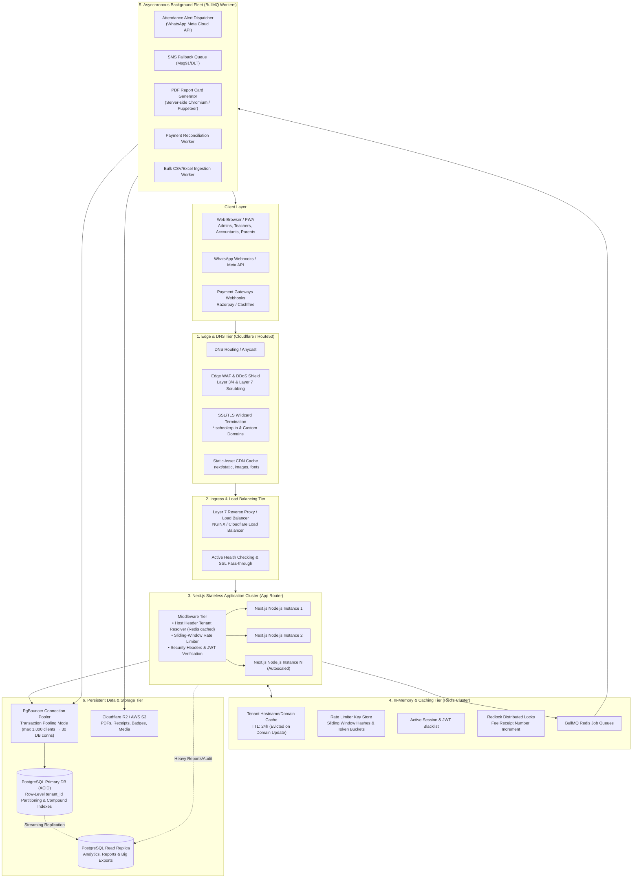
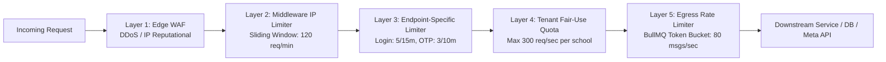
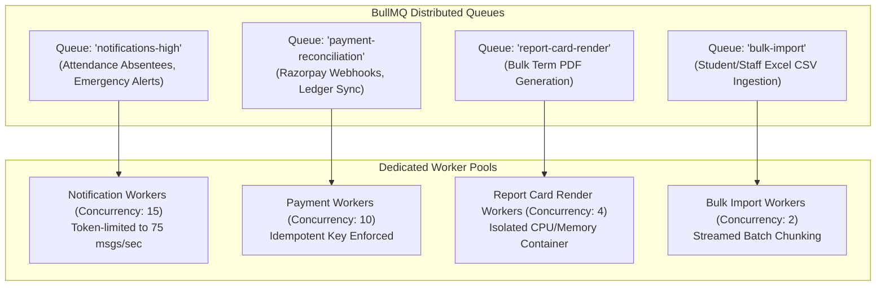
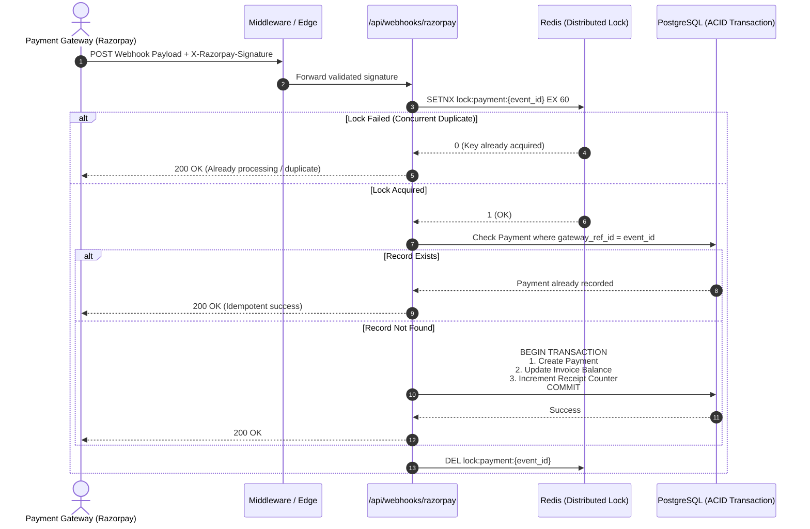

# SYSTEM_ARCHITECTURE: Scalability, Load Handling & Rate Limiting Blueprint

> **Document Type:** Production Infrastructure & High-Availability Architecture  
> **Version:** 1.0  
> **Last Updated:** 2026-09-19  
> **Target Capacity:** 50,000+ Concurrent Students across 500+ School Tenants

---

## 1. High-Level Architecture Overview

The system employs a **Defense-in-Depth, Multi-Layered Asynchronous Architecture** designed for zero tenant cross-talk, sub-100ms API responses, and fault-tolerant spike handling during peak morning attendance and fee collection windows.



---

## 2. Multi-Tier Rate Limiting Architecture

To prevent Denial of Service, brute-force credential stuffing, tenant resource hogging, and third-party API exhaustion, rate limiting is applied across **5 distinct tiers**:



### 2.1 The Rate Limiting Tiers

| Tier | Scope | Algorithm | Threshold | Storage | Action upon Violation |
|------|-------|-----------|-----------|---------|-----------------------|
| **Tier 1: Edge WAF** | Global / IP | Cloudflare DDoS Shield | >1,000 req/min from single IP | Cloudflare Edge | Cloudflare Managed Challenge / 429 Block |
| **Tier 2: Global API** | Per IP Address | Sliding Window Counter | 120 req / 60 seconds | Redis | `429 Too Many Requests` + `Retry-After` |
| **Tier 3: Auth Endpoints** | IP + Identifier | Sliding Window Log | • Login: 5 attempts / 15 mins<br/>• OTP Request: 3 / 10 mins<br/>• Password Reset: 3 / 15 mins | Redis | Account lock delay + `429 Too Many Requests` |
| **Tier 4: Public Inquiries** | IP + Tenant Slug | Token Bucket | 5 submissions / 60 mins | Redis | CAPTCHA / Turnstile challenge + 429 |
| **Tier 5: Tenant Quota** | `tenant_id` | Sliding Window Counter | 300 req / sec per tenant | Redis | Rate limit burst traffic to prevent neighbor starvation |
| **Tier 6: Outbound WhatsApp** | Global Queue | Token Bucket (BullMQ) | 75 messages / sec (Meta limit: 80) | Redis BullMQ | Automatic worker throttling and backpressure buffer |

### 2.2 Redis Sliding Window Rate Limiting Implementation

The sliding window algorithm runs atomically in Redis using a Lua script or atomic multi-exec pipelines to avoid race conditions:

```typescript
// Rate limiting key schema:
// ratelimit:ip:{ip_address}:{route_group}
// ratelimit:tenant:{tenant_id}:{route_group}
// ratelimit:auth:{ip_address}:{normalized_username}

export interface RateLimitResult {
  allowed: boolean;
  limit: number;
  remaining: number;
  resetSeconds: number;
}

export async function checkRateLimit(
  key: string,
  limit: number,
  windowSeconds: number
): Promise<RateLimitResult> {
  const now = Date.now();
  const clearBefore = now - windowSeconds * 1000;

  const pipeline = redis.pipeline();
  // 1. Remove old timestamps outside the window
  pipeline.zremrangebyscore(key, 0, clearBefore);
  // 2. Count requests in current window
  pipeline.zcard(key);
  // 3. Add current request timestamp
  pipeline.zadd(key, now, `${now}-${Math.random()}`);
  // 4. Set TTL on key
  pipeline.expire(key, windowSeconds);

  const results = await pipeline.exec();
  const currentCount = (results?.[1]?.[1] as number) || 0;

  if (currentCount >= limit) {
    return {
      allowed: false,
      limit,
      remaining: 0,
      resetSeconds: windowSeconds,
    };
  }

  return {
    allowed: true,
    limit,
    remaining: Math.max(0, limit - currentCount - 1),
    resetSeconds: windowSeconds,
  };
}
```

---

## 3. Load Handling & Traffic Spikes Management

School ERP systems experience **extreme burst profiles**:
1. **8:30 AM – 9:15 AM:** Morning Attendance Spike (100+ teachers marking 4,500+ students concurrently).
2. **1st – 10th of every month:** Fee Collection Counter Rush (Accountants generating receipts every 15 seconds; parents attempting online payments).
3. **Term End:** Report Card PDF Generation (batch processing 3,000+ complex multi-page graphical PDFs).

### 3.1 Peak Load Handling Strategies

```
Spike Scenario: 8:45 AM Attendance Marking
─────────────────────────────────────────────────────────────────────────────
[Teacher submits 45 attendance records via Mobile PWA]
                     │
                     ▼
             [Next.js Server]
                     │
         ┌───────────┴───────────┐
         ▼                       ▼
[Fast Path: Write DB]    [Async Path: BullMQ]
• Scoped by tenant_id    • Push Job: 'attendance-alert'
• Single ACID commit     • Payload: { tenantId, absentStudentIds, date }
• Latency: < 40ms        • HTTP response returned immediately (200 OK)
                         • Teacher UI unblocked instantly
                                 │
                                 ▼
                         [Worker Fleet]
                         • Fetches parent contact records
                         • Enforces 75 msgs/sec token bucket
                         • Dispatches via WhatsApp Cloud API
                         • If failed → Push to SMS Fallback Queue
```

### 3.2 Database Connection Pooler (PgBouncer)

Without connection pooling, PostgreSQL crashes when hundreds of Next.js serverless/container workers spawn simultaneous connections.

* **Mode:** `Transaction Pooling`
* **Configuration:**
  - Max client connections to PgBouncer: **1,500**
  - Default pool size to PostgreSQL: **25 connections**
  - Min pool size: **10 connections**
  - Reserve pool: **5 connections**
* **Advantage:** Each transaction holds a physical database connection only for the 5–15 milliseconds it takes to execute SQL, allowing 1,500 concurrent HTTP requests to be serviced cleanly by just 25 physical Postgres backend processes.

```ini
# pgbouncer.ini
[databases]
school_erp = host=127.0.0.1 port=5432 dbname=school_erp_prod auth_user=postgres

[pgbouncer]
listen_port = 6432
listen_addr = 0.0.0.0
auth_type = scram-sha-256
auth_file = /etc/pgbouncer/userlist.txt
pool_mode = transaction
max_client_conn = 1500
default_pool_size = 25
min_pool_size = 10
reserve_pool_size = 5
reserve_pool_timeout = 5
server_idle_timeout = 60
```

### 3.3 Database Indexing for Multi-Tenant Query Scale

Every operational table is indexed with `tenant_id` as the **leading prefix** in compound indexes. This guarantees that PostgreSQL B-Trees isolate queries to that school's slice of the partition instantly without scanning other schools' data.

```sql
-- High-throughput operational index examples:
CREATE INDEX idx_students_tenant_class_sec ON "Student" (tenant_id, class_id, section_id);
CREATE INDEX idx_attendance_tenant_date_student ON "Attendance" (tenant_id, date, student_id);
CREATE INDEX idx_invoice_tenant_status_student ON "Invoice" (tenant_id, status, student_id);
CREATE INDEX idx_payments_tenant_date ON "Payment" (tenant_id, created_at DESC);
CREATE INDEX idx_domains_verified ON "TenantDomain" (domain) WHERE is_verified = true;
```

---

## 4. Asynchronous Queuing & Backpressure Management

Heavy computational tasks are strictly prohibited from executing in the synchronous HTTP request-response cycle.

### 4.1 Queue Topology (BullMQ + Redis)



### 4.2 Handling Third-Party API Limits (WhatsApp Meta API)

Meta enforces strict requests-per-second limits on WhatsApp Cloud API phone numbers (Tier 1: 80 messages/second).
BullMQ enforces token bucket rate limiting natively:

```typescript
import { Queue, Worker } from 'bullmq';
import { redis } from '@/lib/redis';

// BullMQ Queue Definition with Rate Limiter
export const notificationQueue = new Queue('notifications-high', {
  connection: redis,
  defaultJobOptions: {
    attempts: 3,
    backoff: {
      type: 'exponential',
      delay: 2000,
    },
    removeOnComplete: true,
    removeOnFail: false,
  },
});

// BullMQ Worker honoring Meta WhatsApp limits
export const notificationWorker = new Worker(
  'notifications-high',
  async (job) => {
    await sendWhatsAppMessage(job.data);
  },
  {
    connection: redis,
    concurrency: 10,
    limiter: {
      max: 75, // Cap under Meta's 80/sec limit
      duration: 1000,
    },
  }
);
```

---

## 5. Webhook Reliability & Financial Idempotency

When Razorpay or Cashfree notifies the server of a payment success:
1. The gateway can retry webhooks multiple times.
2. Network timeouts can cause duplicate calls.
3. If two concurrent requests process the same payment, double fee crediting can occur.

### 5.1 Idempotency Workflow



---

## 6. High Availability, Failover & Disaster Recovery

| Failure Scenario | Impact | Automated Recovery / Mitigation |
|------------------|--------|---------------------------------|
| **Redis Server Down** | Caching and BullMQ queues paused | • Hostname resolver falls back to direct PostgreSQL query.<br/>• Rate limiter degrades to memory LRU cache.<br/>• Background workers pause until Redis auto-reconnects. |
| **PostgreSQL Primary Down** | Database writes unavailable | • Cloud/RDS automated failover promotes Read Replica to Primary in <30s.<br/>• PgBouncer reroutes pool traffic to new primary target. |
| **WhatsApp API 429 / Outage** | Parent notification delays | • Job fails with HTTP 429 → BullMQ exponential backoff kicks in.<br/>• If retries fail after 3 attempts, job fails over to `sms-fallback` queue (Msg91 DLT SMS). |
| **High Memory / Chromium Spike** | PDF generation resource starvation | • Chromium/Puppeteer runs in isolated worker containers capped with strict Docker cgroups memory limits (1GB RAM per worker container). |
| **DDoS Attack on School Domain** | High packet volume | • Cloudflare Anycast CDN absorbs Layer 3/4 SYN floods.<br/>• Layer 7 Edge WAF challenges suspect requests with Turnstile before reaching Next.js origin servers. |

---

## 7. Production Infrastructure Sizing Specifications

### Target: 50,000 Active Students (Tier 2 Scale)

```
┌─────────────────────────────────────────────────────────────┐
│ 1. Edge Layer: Cloudflare Pro / Enterprise (SSL, CDN, WAF)  │
├─────────────────────────────────────────────────────────────┤
│ 2. Compute Fleet:                                           │
│    • 3x Next.js Stateless Nodes (4 vCPU, 8GB RAM each)      │
│    • 2x BullMQ Background Workers (4 vCPU, 8GB RAM each)    │
├─────────────────────────────────────────────────────────────┤
│ 3. In-Memory: Redis 7.x HA (Master + Replica, 4GB RAM)     │
├─────────────────────────────────────────────────────────────┤
│ 4. Database:                                                │
│    • PgBouncer Host (2 vCPU, 2GB RAM)                       │
│    • PostgreSQL Primary (8 vCPU, 32GB RAM, NVMe SSD)        │
│    • PostgreSQL Read Replica (4 vCPU, 16GB RAM)             │
├─────────────────────────────────────────────────────────────┤
│ 5. Storage: Cloudflare R2 (S3-compatible, Zero Egress Fees)│
└─────────────────────────────────────────────────────────────┘
```
